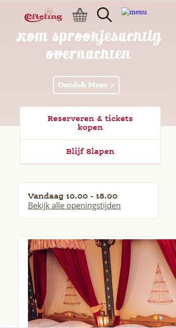
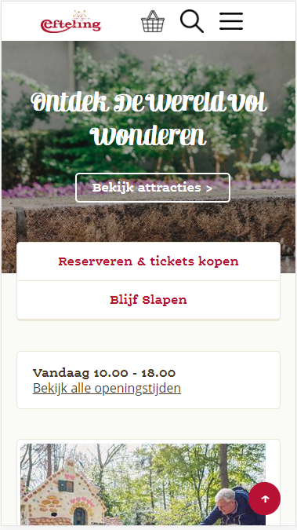
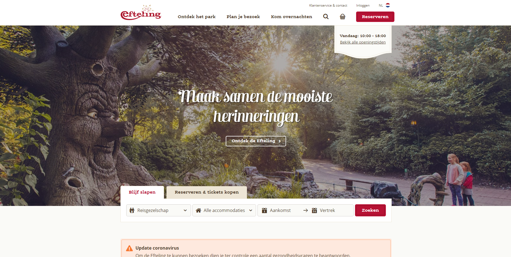
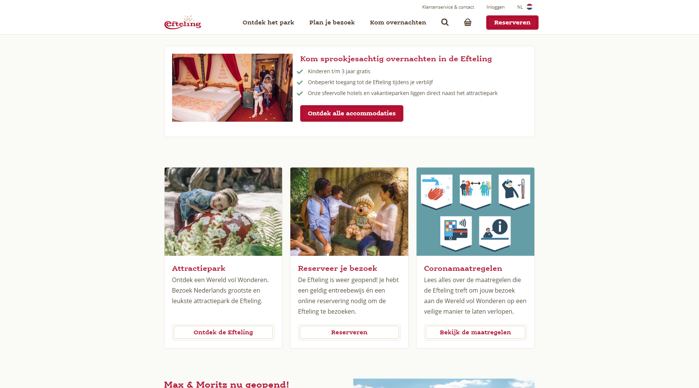
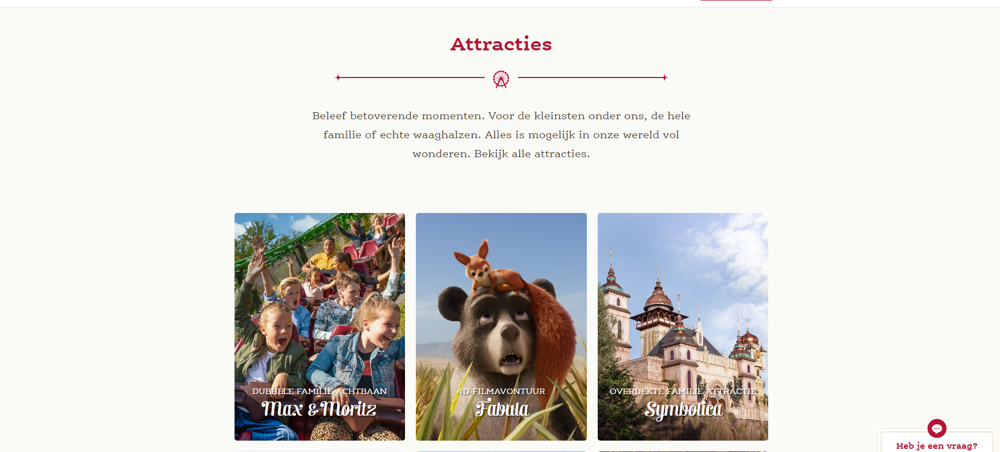
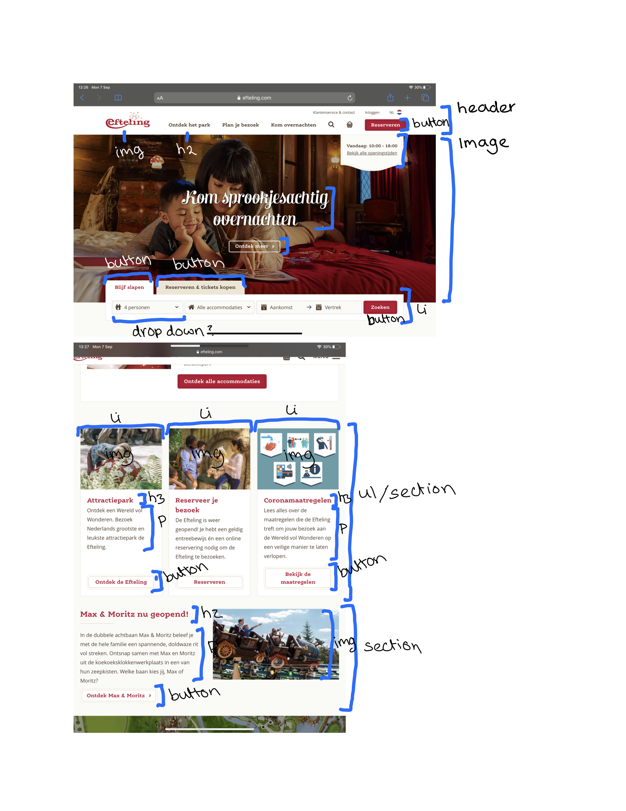

# Procesverslag
**Auteur:** Evi van der Linden

Markdown cheat cheet: [Hulp bij het schrijven van Markdown](https://github.com/adam-p/markdown-here/wiki/Markdown-Cheatsheet). Nb. de standaardstructuur en de spartaanse opmaak zijn helemaal prima. Het gaat om de inhoud van je procesverslag. Besteedt de tijd voor pracht en praal aan je website.

## Bronnenlijst
- Website die ik na ga maken: https://www.efteling.com/nl?utm_source=tradetracker-uk&utm_medium=affiliate&utm_campaign=efteling-uk&utm_cntent=137190
- Hulp bij positioneren van tekst op afbeeldingen: https://css-tricks.com/design-considerations-text-images/
- Hoe maak je een "to top of page" button: https://stackoverflow.com/questions/19188211/how-to-add-fixed-button-to-the-bottom-right-of-page/19188239
- animeren top to page: https://stackoverflow.com/questions/51536384/how-to-animate-scrolling-to-top-of-page-using-javascript-no-jquery/51536923
- Hoe kan je de breedte van een HTML element aanpassen: https://stackoverflow.com/questions/4667651/set-element-width-or-height-in-standards-mode
- Animeren hamburger icoon: https://css-tricks.com/line-animated-hamburger-menu/
- Animeren hamburger icoon: https://www.hongkiat.com/blog/hamburger-menu-animations/
- SVG animeren: https://www.youtube.com/watch?v=gWai7fYp9PY
- SVG animeren: https://www.youtube.com/watch?v=Ca3ZkTV4RdM
- CSS selectoren begrijpen: https://developer.mozilla.org/en-US/docs/Web/CSS/CSS_Selectors
- SvG tag HTML: https://css-tricks.com/using-svg/
- nth-selectors: https://css-tricks.com/useful-nth-child-recipies/
- positioneren hamburger menu: https://dev.to/tongrhj/the-mistake-developers-make-when-coding-a-hamburger-menu-1deg
- fixed menuhttps: //css-tricks.com/forums/topic/fixed-menu-not-scrollable/

## Eindgesprek (week 7/8)
Nou het is zover, ik kan het gaan inleveren... Ben ik tevreden? Jazeker, maar het is gewoon voor mijn gevoel nog niet af. Ik had hier veeeeel meer uit kunnen halen, maar het is me gewoon niet gelukt omdat ik er geen tijd voor had. Ik heb snel nog zoveel mogelijk in mijn website kunnen stoppen (waar ik overigens wel echt trots op ben) maar het is gewoon niet wat het had kunnen zijn. Dingen die ik nog graag had toe willen voegen zijn:
- Hamburger menu SVG animatie, dit is niet gelukt omdat ik niet lang genoeg de tijd heb gehad om uit te zoeken hoe dit werkt.
- Subemnu's Plus naar minnetje SVG animatie, hetzelfde als de vorige.
- Verwijderen van alle classes, ik heb dit geprobeerd maar het blijkt zoveel werk te zijn omdat ik niet de elementen geselecteerd krijg die ik wil. Ik heb op mijn attracties.html pagina wel zo min mogelijk classes gebruikt en ben daar wel blij mee. Maar ik had graag gewild dat mijn Index er ook zo uit zou zien. Ik hoop dat ik met mijn detail pagina wel in ieder geval kan laten zien dat ik begrijp hoe het werkt en dat ik het ook wel kan.
-linkjes visited, hover en active fixen, ik heb ze in mijn code staan maar ik heb ze niet werkend gekregen omdat ze worden overgeschreven door een andere kleur.
-Vloeiend inladen van de attracties bij het scrollen, ik heb ik me nog niet eens in kunnen verdiepen, maar had ik er graag in willen doen.

En over het algemeen wat perfectioneer puntjes om het echt te krijgen hoe ik het gewild. Wel zijn er dingen van de website die me wel gelukt zijn waar ik ook heel trots op ben. Denk bijvoorbeeld aan:
- Het inschuif menu met alle submenuutjes. Deze werken fantastisch en het ziet er echt uit als op de Efteling website. Ik had nooit gedacht dat dit zou lukken en heeft me ook heel lang geduurd.
- De footer, dit is in principe hetzelfde systeem als bij het menu, maar dan iets makkelijker omdat het niet hoeft in te schuiven.
- De laad meer knop bij attracties vind ik heel leuk, het is een simpel iets maar toch heel leuk dat ik het werkend heb gekregen.
- De SVG animatie van het reuzenradje dat de hele tijd draait, dit is zonder twijfel mijn favoriete element op de website.
- De top-to-page knop die ik voor elkaar heb gekregen. Hij loopt smooth naar boven en dat is ook wel leuk.
- Over het algemeen de uitstraling van de Website, ik vind zelf dat het me erg goed gelukt is om het gevoel van de Efteling website over te brengen en na te maken. Op het punt dat ik zelf soms verward was welke van mij was en welke de originele ;)

Over het algemeen ben ik wel heel trots op wat ik heb neer kunnen zetten. Het is zeker nog niet klaar, maar ik heb mijn best gedaan om nog zo ver mogelijk te komen. Ik heb veel frustraties en moeilijkheden gehad met het maken van de website, in het begin ben ik 3x opnieuw begonnen, toen ik mijn classes had weggehaald moest ik mijn code 'resetten' omdat ik het niet gefixt kreeg, en nog tientallen andere hindernissen tijdens het coderen en programmeren waar ik uren over heb gedaan om eruit te komen.

Wel heb ik echt een enorme vooruitgang geboekt dankzij dit vak in mijn vaardigheden op het gebied van html/css, maar ook zeker javascript en animeren met css. Ik heb veel nieuwe dingen geleerd en vond het ook een leuke opdracht om te doen. Ik zou nu ook de websites die ik vorig jaar heb gemaakt veel sneller en beter kunnen maken, omdat ik alles beter begrijp en ook meer kan. Al met al voor mij dus een geslaagd project, alleen jammer dat het niet 100% compleet is. Als ik daardoor een herkansing zou krijgen zou ik het niet eens zo erg vinden, omdat ik het dan verder af kan maken. Maar misschien is dat helemaal niet nodig!

**Screenshot(s):**

## Voortgang 3 (week 6)
### Stand van zaken
Laat ik beginnen met zeggen dat ik 1 week tussen 2 voortgangsgesprekken eigenlijk te weinig is. Deze week hadden we namelijk verschillende deadlines van andere vakken, waardoor dit vak al snel even naar de achtergrond verdwijnt. Ik heb zeker niet stilgezeten, maar ik had liever het gesprek een halve week tot week later willen hebben. (in de herfsvakantie was perfect geweest, maarja, dan is het 'vakantie'). 

Over het algemeen heb ik de draad weer opgepakt waar ik gebleven was. Ik had vorige week wat dingen genoteerd die ik graag af wil hebben, en dat is wel redelijk gelukt. Mijn detailpagina heb ik verder op orde gemaakt, deze is nu zo ver af. Alle attracties staan mooi op een rijtje en zien er goed uit. De footer ben ik eerlijk gezegd nog niet aan begonnen, en ik weet niet zo goed waarom. Ik vind de footer denk ik het aller saaiste om aan te beginnen, en stel deze dan dus ook wat meer uit. Ik vind het leuker om eerst een begin te maken aan verschillende micro-interacties en animaties. 

Hier ben ik dan ook al mee begonnen. Ik heb enorm zitten kloten met een animatie maken voor mijn menu; dat hij van een hamburger naar een kruis gaat. Dit blijkt nog verassend moeilijk te zijn. Ik heb al tientallen voorbeelden bekeken en uitgeprobeerd in mijn eigen website, maar heb tot nu toe nog geen succes. Ik heb het gevoel dat de animatie wel werkt, maar ik krijg hem niet lekker gepositioneerd in mijn navigatie. Hierdoor zie je hem meestal niet eens of gebeuren er de gekste dingen met de andere elementen. Daarom heb ik dat even aan de kant gezet en ben ik begonnen aan een andere animatie; een SVG animatie! Dit was zonder twijfel voor mij het 'hoogtepunt' van werken aan de website. 

Ik heb namelijk zelf een reuzenradje gemaakt in Illustrator (dat is sowieso al leuk) en vervolgens ontdekt hoe je zo'n SVG eigenlijk redelijk makkelijk helemaal kan aanpassen in html/css. Ik kwam er bijvoorbeeld achter dat als je een SVG opent hij automatisch de properties (fill, kleur, lijndikte) heeft overgezet naar een style in css. Toen begreep ik dus dat ik ook makkelijk vanuit de css mijn SVG kon aanpassen zonder constant illustrator te openen. Ook had ik door dat hij letterlijk alle vormen die je hebt gebruikt voor de SVG laat zien als vormen (circle, polygon, square etc) en ben ik gaan kijken wat alle getalletjes doen als je ze aanpast. Zo heb ik geprobeerd zelf een polygon te maken zonder het gebruik van Illustrator, maar dat was nog best lastig. Ik kwam toen uit op <polygon points="250,60 100,400 400,400"/>, maar het was iedere keer net niet wat ik wilde. uiteindelijk heb ik toch maar Illustrator ingeschakeld. 

Ook het gebruik van Keyframes vond ik leuk en interessant, dat je daarmee makkelijk een animatie kan maken en een eigen naam geven. Toen ik voor het eerst een animatie had gemaakt en ik ontdekte dat het lukte, schoten me ineens heel veel ideeen te binnen van dingen die ik had kunnen maken. Maar ik heb hier simpelweg in de laatste 2 weken te weinig tijd voor. Dus misschien dat ik in mijn vrije tijd het nog een keer ga oppakken om te kijken wat er nog meer mogelijk is met keyframes en SVGtjes. 

Naast het animeren ben ik heel trots begonnen aan het weghalen van al mijn classes, maar dit werkte helaas averechts. Ik heb denk ik te weinig gecontroleerd hoe mijn website eruit zou komen te zien als ik bepaalde dingen weg zou halen. Hierdoor was dus uiteindelijk mijn hele website verpest en stond eigenlijk niks meer hoe het zou horen te staan. Dit oplossen heeft me veel tijd gekost en was echt weer een demotiverende klap. Ik ben blij dat ik alleen classes heb gebruikt in mijn hoofdpagina en niet de detailpagina. Over het algemeen snap ik nogsteeds niet 100% het nut van geen classes hebben in je html, omdat ik nu echt het gevoel heb dat iemand anders er niks van zal begrijpen wat wat is. Zelf ben ik ook lang aan het zoeken welk element ik nou precies moet hebben in css omdat alles eigenlijk dezelfde namen heeft. Ik probeer nu met commentaar duidelijk te maken waar wat staat, maar of dit nou fijner is dan met classes werken betwijfel ik...

### Agenda voor meeting
- Bespreken hoe je een animatie kan laten gebeuren - eenmalig - zodra je de pagina inlaadt.
- Oplossen error in code van javascript
- Waarom is het zo belangrijk dat je zo weinig mogelijk classes hebt (ik vind het maar onduidelijkheid scheppen)
- Bepaald stukje in mijn code: Moet dit een article of section zijn?

### Verslag van meeting
De meeting van deze keer verliep een heel stuk soepeler dan de keer met de studentassistent. Dit ligt niet aan de assistenten, maar ik vind het over het algemeen fijn er om met de docent over de eindopdracht te praten omdat hij ook degene is die het moet beoordelen. Dus Danny's kijk op dingen vind ik belangrijker voor de eindopdracht dan die van andere (klinkt misschien raar, maar het is zo haha). 

Ik heb er dus voor gekozen om bij dit gesprekje vooral te focussen op de eisen voor een voldoende, aangezien dat ook belangrijk is om te weten. Zo is het voor mij nu duidelijk dat ik qua surface plane de goede kant op ga. Ik moet nog een paar animatied toevoegen. De menu slide in samen met de top-to-page is knop telt als 1 goede animatie. Daarnaast als ik met SVG ga animeren (menu knop animatie en reuzenrad op attracties homepage) kan ik nog wat extra puntjes scoren. Ook is het nog belangrijk dat ik laat zien wanneer iets visited is, of active. 

Ook is mij nu duidelijk dat ik niet per se alle attracties hoef te laten zien van de attracties pagina, omdat dat me simpelweg te veel tijd zou gaan kosten. Een stuk of 10 zou genoeg moeten zijn. Danny had nog het leuke idee om dan te werken met een "laad meer" knop waarbij je dus meer resultaten krijgt te zien als je die gebruikt. 

Verder is dus alles voor mij duidelijk wat er nog moet gebeuren voor de eindbeoordeling.

## Voortgang 2 (week 5)
### Stand van zaken
De weken na het eerste voortgangsgesprek gingen niet zoals gepland. Ik was heel gemotiveerd en was goed opweg, ik liep zelfs op dat moment voor op sommige andere studenten. Opeens kreeg ik een appartement en moest ik volledig omschakelen en alles zo snel mogelijk gaan verhuizen. Kwam dit op het juiste moment? Absoluut niet. Ik heb hierdoor mijn schoolwerk een week tot 2 weken verwaarloosd omdat ik er simpelweg geen tijd voor had en ook niet de middelen om eraan te werken. 

Bij andere vakken was dat voor mij niet zo'n issue, maar voor FeD is dat heel lastig geweest. Ik merkte vorig jaar al dat vakken waar je voor moet coderen erg lastig zijn om bij te houden als je een weekje hebt gemist. Ik heb er dan ook vrij weinig aan gewerkt. Het is me gelukt om een begin te maken aan de detail pagina, en met een begin bedoel ik ook echt alleen een begin. Wel is het me nog gelukt om mijn menu een animatie te geven zodat hij eruit slide. Alleen hij komt nog in de pagina vanaf de verkeerde kant. 

Mijn detailpagina is verder echt nog een mess, ik heb wel al zitten spelen met positionering en hoe ik de fonts eventueel goed kan krijgen, maar dat is allemaal nog niet zo succesvol. Al met al ben ik erg teleurgesteld dat ik zo weinig heb kunnen doen, en ik baal er ook gewoon van. Het zou me niks verbazen als dit mijn eerste vak wordt wat ik moet herkansen...

Dingen die ik nog moet doen asap voor volgende week:
- Detailpagina afmaken
- Footer in orde maken
- Github beter aanvullen en bijhouden
- werken aan micro-interactie

**Screenshot(s):**

### Agenda voor meeting
1. Bespreken in hoeverre je je github moet vullen
2. Bespreken micro-animaties, hoeveel animaties zullen voldoende zijn
3. Bespreken het verschil tussen article en section

(het groepje geeft weinig input, iemand die heeft zijn site al af en heeft geen agenda punten meer, en iemand die zegt dat ze nog niet ver is. De agenda punten van deze week komen dus van 2 mensen af.)

### Verslag van meeting
De meeting verliep stroef en ging niet zo lekker als de eerste meeting. Ik had bij dit gesprek liever bij een ander groepje willen belanden die veel hadden gedaan deze weken, zodat er wat meer besproken kon worden. Ik kreeg een sterk gevoel dat ik niet de enige was die weinig progressie had gemaakt deze weken. 
De dingen die we hebben besproken zijn wel nuttig.

- Over Github werd kort en krachtig gesproken; Zet in principe zoveel mogelijk in Github van je process en je denkwijzes. Laat zien hoe je aan bepaalde dingen komt en hoe je ze gemaakt hebt. Laat eventueel ook huiswerk zien wat je gemaakt hebt om te laten zien dat je je best hebt gedaan. Vraag eventueel aan medestudenten hoe hun Github eruit ziet om daar ook inspiratie vandaan te halen.

- Het verschil tussen een article en section is voor mij bij het vorige gesprek al beantwoord. Bij een section is het essentieel om een h1, h2 etc te bevatten. Een article functioneert op zichzelf. 

- Verder heb ik geleerd dat de HvA over het algemeen erg streng is over semantisch correcte code, dus dat is iets waar ik nog extra aandacht aan ga besteden.
- Ook is het belangrijk om de classeritus weg te halen die bij mij nog wel zeker aanwezig is, ook moet ik nog wat sections weg gaan halen die overbodig zijn.

## Voortgang 1 (week 3)

### Stand van zaken
In week 2 en 3 ben ik echt begonnen met het coderen van de website. Al snel liep ik tegen vanalles aan en werd ik enorm gefrustreerd. Ik begon met de header (navigatie) te maken van de website, maar dit bleek nog moeilijker dan ik had verwacht. 

De navigatie van De Efteling in mobile versie bestaat namelijk alleen uit icoontjes, dit had ik nog nooit eerder gedaan. Ik heb 3 pogingen gedaan om dit op orde te krijgen. Ik had dan weer met css wat 'gekloot' en uiteindelijk alle regels uit frustratie weer verwijderd en opnieuw begonnen. Op gegeven moment kwam ik met het uitstekende idee om eerst verder te gaan met de content van de website. 

Toen ik dat besloten had ging het opeens een stuk beter en werd het ook een beetje leuk om eraan te werken. Ik merkte al snel dat ik het het fijnste vond om gewoon bovenaan te beginnen en zo langzaam naar beneden alles op orde te maken. Daarbij deed ik de html en css eigenlijk tegelijk zodat ik het gevoel had dat een gedeelte echt al af was. Zo had ik meer motivatie om de rest van de website af te maken en eigenlijk voor een poos niet meer terug hoefde naar iedere keer datzelfde stukje code, klaar is klaar.

Wel vond ik het nog erg moeilijk om dingen exact als de originele website te krijgen. Als perfectionist zijnde is zo'n opdracht best lastig, omdat ik het eigenlijk nooit genoeg vond. Het was het altijd net niet, dan weer een tikkeltje te groot, dan weer te klein, nu moet het weer meer naar rechts... Het was best moeilijk om dit even los te laten en me te concentreren op wat grotere dingen en later pas terug te komen op de details. 

**Screenshot(s):**

### Agenda voor meeting

We hebben samen met ons groepje afgesproken dat we de volgende zaken gaan bespreken:
1. Hamburger menu; hoe werkt het uitklappen met javascript en hoe krijg je het goed gepositioneerd.
2. Flexbox toepassen op context; hoe zorg je ervoor dat flexbox doet wat je wil.
3. Hoe krijg je de icoontjes in de navigatiebalk zoals jij dat wil, inclusief logo.

### Verslag van meeting
1. Je kan iconen in een navigatie makkelijk aanpassen door gebruik te maken van SVG bestanden. Je kan namelijk makkelijk de properties van een SVG aanpassen, zoals de hoogte en breedte. Zo kun je er makkelijk voor zorgen dat alle iconen er hetzelfde uitzien en kun je je navigatie maken. Voor het animeren van het menu kun je kijken naar de opdracht van de vorige les waarin er ook werd gewerkt met een slide-in menu.

2. Het is belangrijk dat je flexbox toepast op de juiste content. Let hierbij goed op het gebruik van sections en gebruik deze ook zeker niet te veel. De basisregel is dat je voor iedere section een titel nodig hebt. Dus een H1, H2 etc. Als je je sections op orde hebt is het al een stuk makkelijker om een overzicht te hebben op welke elementen in je HTML je flexbox kan en moet toepassen.

3. Let erop dat je niet teveel classes gebruikt in je html. Probeer zoveel mogelijk te werken met nth-of-type() om -zoals Danny het noemt- Classerietus te voorkomen. Gebruik classes alleen waar het echt nodig is, zoals het stylen van dezelfde element types op verschillende pagina's.

## Intake (week 1)

**Je startniveau:** Rode Piste 

**Je focus:** Surface Plane

**Je opdracht:** De Website van de Efteling. Pretparken zijn mijn aller grootste passie en de Efteling staat ver bovenaan mijn lijstje van favoriete parken. Ik heb hier een abonnement en ga er vaak naartoe. Ik heb dan ook enig gevoel voor de stijl van de Efteling en heb hun website al regelmatig bekeken. De lay-out die ze gebruiken is niet al te ingewikkeld om na te maken lijkt me.

De twee pagina's die mij het leukst lijken om te maken van de website is de homepagina en het overzicht van alle attracties in de Efteling. Dit is natuurlijk het meest kenmerkende deel van de Efteling voor de meeste. Op de attractie pagina werkt de Efteling met bepaalde animaties als je over de afbeeldingen hovert. Dit wordt de grootste uitdaging voor mij om dit na te kunnen maken. Daarnaast gebruikt de Efteling ook een eigen gemaakt font wat dus moeilijk na te bootsen is, dit is ook een uitdaging.

**Screenshot(s):**

**Breakdown-schets(en):**

